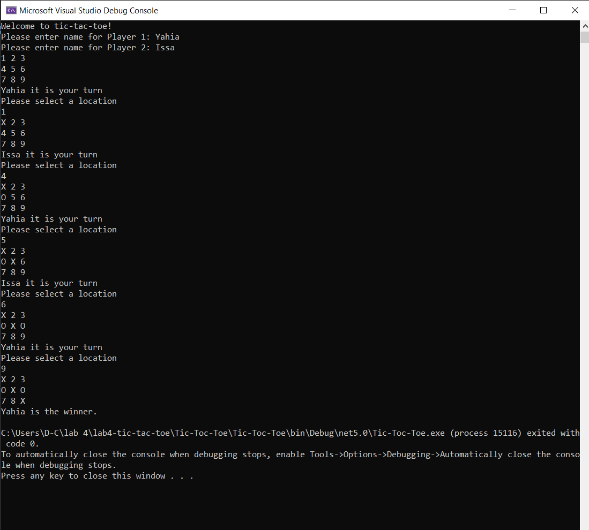

# lab4-tic-tac-toe

## Description:

The purpose is to allow two users to play a tic tac toe game that will determine a winner or a tie. and you can play it by this steps:

- Write first player name.
- Write secound player name.
- Choose The first player the position for his symbol which is X and secound player choose the position for his symbol which is O.
- First one between two players will end a row or coloum or diagonal by his symbol will be a winner. If both of them not win so it is will be a draw.

## Visual

